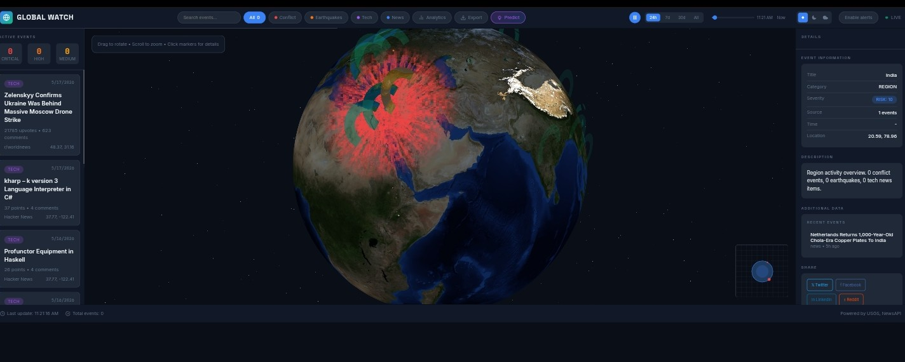

# Core-x — Global Watch 🌍

<div align="center">



[](LICENSE)
[](https://www.python.org/)
[](https://threejs.org/)
[](https://socket.io/)
[](https://gracemanager.onrender.com)

**Core-x (Global Watch)** is a sophisticated real-time world monitoring system. It visualizes global events—from natural disasters to breaking news—on an interactive 3D globe, providing instant situational awareness through a high-performance data pipeline.

[Live Demo](https://gracemanager.onrender.com) · [Report Bug](https://github.com/alpha-1-design/Core-x/issues) · [Contributing](./CONTRIBUTING.md)

</div>

---

## 🚀 Tech Stack

| Category | Technologies |
| :--- | :--- |
| **Frontend** |     |
| **Backend** |    |
| **Deployment** |   |

---

## ✨ Key Features

*   **Live 3D Visualization:** High-fidelity interactive Earth globe with real-time marker placement.
*   **Multi-Source Intelligence:** Aggregates data from **USGS (Earthquakes)**, **Reddit (World News)**, **Hacker News (Tech)**, and **GDELT (Global Events)**.
*   **Real-time Synchronization:** Powered by WebSockets for instant, non-polling data updates.
*   **Intelligent Filtering:** Category-based event isolation (News, Tech, Seismic, Conflict).
*   **Global Health Scoring:** Heatmap-style regional activity levels and severity indicators.
*   **Situational Awareness:** Fly-to animations and detailed event metadata tooltips.

---

## 🏗️ Architecture

Core-x operates on a specialized asynchronous pipeline:
1.  **Ingestion:** Python background workers poll high-authority global APIs.
2.  **Processing:** Events are normalized, scored for severity, and deduplicated.
3.  **Broadcasting:** The Flask-SocketIO server pushes live updates to all connected clients.
4.  **Rendering:** Three.js processes the data stream to render dynamic points of interest on the 3D globe.

---

## 🛠️ Installation & Setup

### Prerequisites
*   Python 3.10+
*   Node.js (for frontend local testing if using specialized build tools)

### Quick Start
```bash
# Clone the repository
git clone https://github.com/alpha-1-design/Core-x.git
cd Core-x

# Set up virtual environment
python -m venv venv
source venv/bin/activate  # On Windows: venv\Scripts\activate

# Install dependencies
pip install -r requirements.txt

# Run the server
python server.py
```
Visit `http://localhost:5000` to view the globe.

---

## 🗺️ Roadmap: MiroFish Integration

The future of Core-x lies in **Predictive Simulation**. We are working on integrating **MiroFish**, a multi-agent AI simulation engine, to:
*   **Simulate Reactions:** Model how AI agents react to real-world events.
*   **Predict Escalation:** Detect early signals of event escalation.
*   **Disaster Impact:** Visualize potential impact zones before they stabilize.

---

## 📡 API Reference

| Endpoint | Method | Description |
| :--- | :--- | :--- |
| `/api/events` | GET | Returns all active global events. |
| `/api/regions` | GET | Returns regional activity scores. |
| `/api/stats` | GET | Summary statistics of current event data. |
| `/ws` | WS | WebSocket endpoint for real-time event streaming. |

---

## 📜 License & Attribution

Distributed under the **MIT License**. See `LICENSE` for more information. Built for the Alpha-1 Ecosystem.
